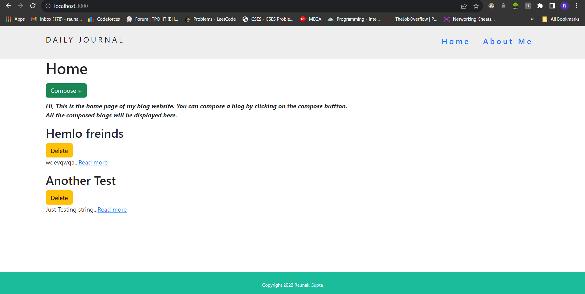

# Blog Website

This is a simple blog website built using Node.js, Express.js, MongoDB, and EJS. The website allows users to create and delete blog posts.

# Screenshot

*Home Page*

## Table of Contents

- [Features](#features)
- [Getting Started](#getting-started)
  - [Prerequisites](#prerequisites)
  - [Installation](#installation)
- [Usage](#usage)
- [Contributing](#contributing)

## Features

- Create new blog posts with a title and content.
- View a list of all blog posts on the homepage.
- Click on a blog post to view its full content.
- Delete unwanted blog posts.

## Getting Started

### Prerequisites

Before you begin, ensure you have met the following requirements:

- Node.js installed.
- MongoDB installed and running.


### Installation

1. Clone the repository:

   ```bash
    git clone https://github.com/Raunik2/Blog-Website-v2.0.git

2. Navigate to the project directory:
   
   ```bash
   cd Blog-Website-v2.0

4. Install dependencies:
   
   ```bash
   npm install

6. Start the application:
   
   ```bash
   npm start
   
7. Open your web browser and navigate to the following URL:
   
   ```bash
   http://localhost:3000

# Usage

- To create a new blog post, click on the "Compose" button on the homepage, fill in the title and content, and click "Publish."
- To view a blog post, click on its title on the homepage.
- To delete a blog post, click the "Delete" button next to the post on the homepage.

# Contribution
1. Fork the repository to your own GitHub account.
2. Create a new branch for your feature or bug fix: `git checkout -b feature-name`.
3. Make your changes and commit them: `git commit -m 'Add some feature'`.
4. Push your changes to your forked repository: `git push origin feature-name`.
5. Create a pull request (PR) on the main repository.
6. Provide a clear and descriptive title for your PR.
